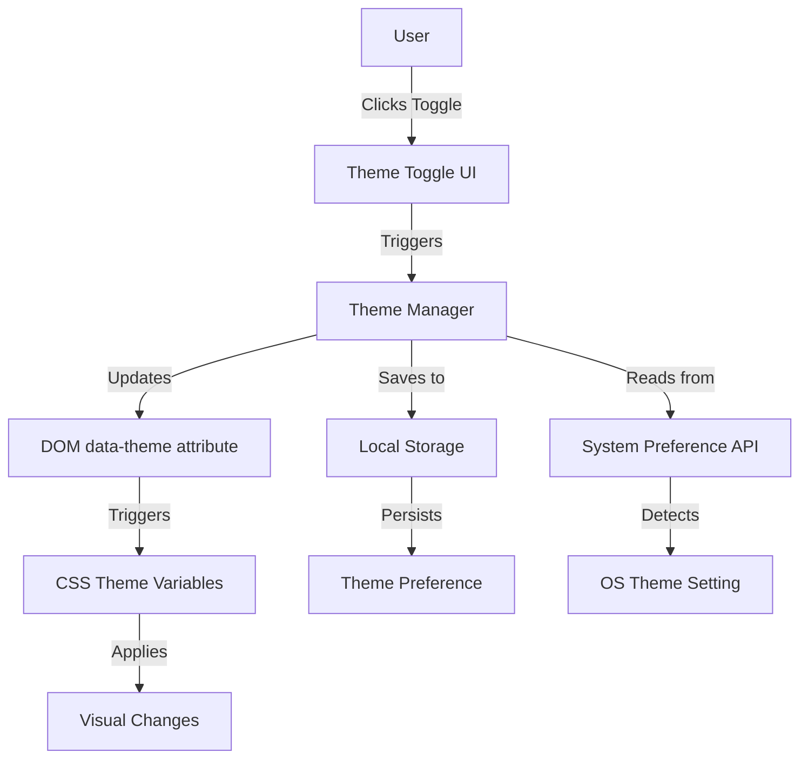

# Design Document: Light/Dark Mode

## Overview

This design document describes the implementation of a theme system that enables users to toggle between light and dark color schemes in the Productivity Dashboard application. The system will provide a seamless, accessible, and persistent theming experience.

The theme system consists of three main components:
1. **Theme Manager**: Core logic for theme state management, persistence, and application
2. **Theme Toggle UI**: User interface control for switching themes
3. **CSS Theme Variables**: Dual color palettes defined using CSS custom properties

The implementation leverages existing CSS variables in the application, extending them to support both light and dark modes. The system will detect the user's operating system preference on first visit, persist theme choices in Local Storage, and ensure all UI elements consistently reflect the selected theme.

Key design principles:
- Minimal DOM manipulation (class-based theme switching)
- CSS-driven visual changes for performance
- Progressive enhancement (graceful degradation if JavaScript fails)
- Accessibility-first approach (WCAG AA compliance)

## Architecture

### System Components



### Component Responsibilities

**Theme Manager (JavaScript Module)**
- Initialize theme system on page load
- Detect system theme preference using `prefers-color-scheme` media query
- Load saved theme preference from Local Storage
- Apply theme by setting `data-theme` attribute on document root
- Handle theme toggle events
- Persist theme changes to Local Storage
- Provide public API for theme operations

**Theme Toggle UI (HTML/CSS Component)**
- Render toggle button in dashboard header
- Display current theme state (icon or text indicator)
- Emit toggle events when activated
- Support keyboard interaction (Enter, Space)
- Provide ARIA labels and live region announcements

**CSS Theme System (Stylesheet)**
- Define light theme variables (default)
- Define dark theme variables (scoped to `[data-theme="dark"]`)
- Apply smooth transitions to color properties
- Maintain contrast ratios for accessibility
- Ensure consistent styling across all components

### Data Flow

1. **Initialization Flow**:
   - Page loads → Theme Manager initializes
   - Check Local Storage for saved preference
   - If found: Apply saved theme
   - If not found: Check system preference → Apply matching theme
   - Update toggle UI to reflect current theme

2. **Toggle Flow**:
   - User activates toggle → Event fired
   - Theme Manager receives event
   - Determine opposite theme
   - Update `data-theme` attribute on `<html>` element
   - Save new preference to Local Storage
   - Announce change to screen readers

3. **Persistence Flow**:
   - Theme change occurs
   - Serialize theme value ("light" or "dark")
   - Store in Local Storage with key `theme-preference`
   - Handle storage errors gracefully (log, continue with in-memory state)

## Components and Interfaces

### Theme Manager Module

**File**: `js/theme-manager.js`

**Public API**:
```javascript
// Initialize the theme system
function initTheme(): void

// Get current theme
function getCurrentTheme(): 'light' | 'dark'

// Set theme explicitly
function setTheme(theme: 'light' | 'dark'): void

// Toggle between themes
function toggleTheme(): void

// Check if dark mode is active
function isDarkMode(): boolean
```

**Internal Functions**:
```javascript
// Detect system theme preference
function getSystemTheme(): 'light' | 'dark'

// Load theme from Local Storage
function loadSavedTheme(): 'light' | 'dark' | null

// Save theme to Local Storage
function saveTheme(theme: 'light' | 'dark'): void

// Apply theme to DOM
function applyTheme(theme: 'light' | 'dark'): void

// Announce theme change to screen readers
function announceThemeChange(theme: 'light' | 'dark'): void
```

### Theme Toggle Component

**HTML Structure**:
```html
<button 
  id="theme-toggle" 
  class="theme-toggle"
  aria-label="Toggle theme"
  aria-pressed="false">
  <span class="theme-icon" aria-hidden="true"></span>
  <span class="theme-label">Dark Mode</span>
</button>
```

**Integration Point**: Dashboard header (`.dashboard-header`)

**Event Handling**:
- Click event → `toggleTheme()`
- Keyboard events (Enter, Space) → `toggleTheme()`
- Update `aria-pressed` attribute on theme change
- Update icon and label text on theme change

### CSS Theme Variables

**Light Theme (Default)**:
```css
:root {
  --background-color: #f5f7fa;
  --widget-background: #ffffff;
  --text-color: #333333;
  --text-muted: #6c757d;
  --border-color: #e1e4e8;
  --shadow: 0 2px 8px rgba(0, 0, 0, 0.1);
  --primary-color: #4a90e2;
  --secondary-color: #6c757d;
  --success-color: #28a745;
  --danger-color: #dc3545;
}
```

**Dark Theme**:
```css
[data-theme="dark"] {
  --background-color: #1a1a1a;
  --widget-background: #2d2d2d;
  --text-color: #e4e4e4;
  --text-muted: #a0a0a0;
  --border-color: #404040;
  --shadow: 0 2px 8px rgba(0, 0, 0, 0.3);
  --primary-color: #5ca3f5;
  --secondary-color: #8a8a8a;
  --success-color: #3dbd5d;
  --danger-color: #e85d6a;
}
```

**Transition Configuration**:
```css
* {
  transition: background-color 0.3s ease,
              color 0.3s ease,
              border-color 0.3s ease,
              box-shadow 0.3s ease;
}
```

## Data Models

### Theme Preference Storage

**Local Storage Key**: `theme-preference`

**Value Format**: String literal `"light"` or `"dark"`

**Storage Schema**:
```typescript
interface ThemePreference {
  key: 'theme-preference';
  value: 'light' | 'dark';
}
```

**Error Handling**:
- If Local Storage is unavailable (privacy mode, quota exceeded): Continue with in-memory state
- If stored value is invalid: Fall back to system preference or default (light)
- Log errors to console for debugging

### Theme State

**In-Memory State**:
```typescript
interface ThemeState {
  current: 'light' | 'dark';
  isSystemDefault: boolean;
  isInitialized: boolean;
}
```

**DOM State**:
- Attribute: `data-theme` on `<html>` element
- Values: `"light"` or `"dark"`
- Used by CSS selectors to apply theme-specific styles

### System Preference Detection

**Media Query**: `(prefers-color-scheme: dark)`

**Detection Method**:
```javascript
const prefersDark = window.matchMedia('(prefers-color-scheme: dark)').matches;
const systemTheme = prefersDark ? 'dark' : 'light';
```

**Listener** (optional enhancement):
```javascript
window.matchMedia('(prefers-color-scheme: dark)')
  .addEventListener('change', (e) => {
    // Only respond if user hasn't set manual preference
    if (!hasManualPreference()) {
      applyTheme(e.matches ? 'dark' : 'light');
    }
  });
```


## Correctness Properties

*A property is a characteristic or behavior that should hold true across all valid executions of a system—essentially, a formal statement about what the system should do. Properties serve as the bridge between human-readable specifications and machine-verifiable correctness guarantees.*

### Property Reflection

After analyzing all acceptance criteria, I identified several areas where properties can be consolidated:

- Properties 2.1, 2.2, and 2.4 (dark mode color application) can be combined into a single comprehensive property about theme color application
- Properties 6.1, 6.2, 6.3, and 6.4 (theme application to different element types) can be combined into a single property about universal theme application
- Properties 4.1 and 4.3 (transition application) can be combined into a single property about transitions on themed properties
- Properties 5.2 and 5.3 (system preference application) are specific examples that should be tested as examples, not separate properties
- Properties 7.1 and 2.3 (contrast ratios) are testing the same requirement and can be combined

This consolidation reduces redundancy while maintaining comprehensive coverage of all functional requirements.

### Property 1: Theme Toggle State Display

*For any* current theme state (light or dark), the theme toggle UI should display that state accurately through its visual indicator and ARIA attributes.

**Validates: Requirements 1.2**

### Property 2: Theme Toggle Switches to Opposite

*For any* current theme state, activating the theme toggle should switch the system to the opposite theme (light → dark, dark → light).

**Validates: Requirements 1.3**

### Property 3: Keyboard Accessibility

*For any* keyboard event (Enter or Space key) on the theme toggle, the system should trigger the theme switch action.

**Validates: Requirements 1.4, 7.2**

### Property 4: Theme Color Application

*For any* active theme (light or dark), all UI elements (widgets, text, interactive elements, backgrounds, borders) should have the CSS variables corresponding to that theme applied.

**Validates: Requirements 2.1, 2.2, 2.4, 6.1, 6.2, 6.3, 6.4**

### Property 5: CSS Variables Update on Theme Switch

*For any* theme switch operation, all CSS custom properties (--background-color, --text-color, --widget-background, etc.) should update to the values defined for the new theme.

**Validates: Requirements 2.5**

### Property 6: Contrast Ratio Compliance

*For any* theme (light or dark), all text/background color pairs should maintain WCAG AA contrast ratios (minimum 4.5:1 for normal text, 3:1 for large text).

**Validates: Requirements 2.3, 7.1**

### Property 7: Theme Persistence Round Trip

*For any* theme selection, saving to Local Storage and then retrieving should return the same theme value.

**Validates: Requirements 3.1, 3.2**

### Property 8: Saved Theme Application

*For any* theme preference stored in Local Storage, when the dashboard loads, the system should apply that saved theme.

**Validates: Requirements 3.3**

### Property 9: Local Storage Error Handling

*For any* Local Storage error (quota exceeded, unavailable, permission denied), the theme system should continue functioning with in-memory state without throwing unhandled exceptions.

**Validates: Requirements 3.5**

### Property 10: Transition Application

*For any* theme switch, CSS transitions should be applied to all color-related properties (background-color, color, border-color, box-shadow).

**Validates: Requirements 4.1, 4.3**

### Property 11: Transition Duration

*For any* theme switch, all CSS transitions should complete within 300 milliseconds.

**Validates: Requirements 4.2**

### Property 12: Layout Stability During Transitions

*For any* theme switch, element positions and dimensions should remain unchanged (no layout shift).

**Validates: Requirements 4.4**

### Property 13: System Preference Detection

*For any* first-time load (no saved preference), the theme system should query the `prefers-color-scheme` media query and apply the matching theme.

**Validates: Requirements 5.1**

### Property 14: Manual Preference Override

*For any* manual theme selection by the user, the system should apply that theme regardless of system preference and persist it for future sessions.

**Validates: Requirements 5.4**

### Property 15: Screen Reader Announcements

*For any* theme change, the system should update ARIA live regions or attributes to announce the change to assistive technologies.

**Validates: Requirements 7.3**

### Property 16: Focus Indicator Preservation

*For any* theme (light or dark), focused interactive elements should have visible focus indicators that meet visibility requirements.

**Validates: Requirements 7.5**

## Error Handling

### Local Storage Errors

**Error Scenarios**:
1. Local Storage unavailable (privacy mode, disabled)
2. Quota exceeded
3. Security exceptions

**Handling Strategy**:
- Wrap all Local Storage operations in try-catch blocks
- Log errors to console for debugging
- Fall back to in-memory theme state
- Continue normal operation without persistence
- Display no error to user (graceful degradation)

**Implementation**:
```javascript
function saveTheme(theme) {
  try {
    localStorage.setItem('theme-preference', theme);
  } catch (error) {
    console.warn('Failed to save theme preference:', error);
    // Continue with in-memory state
  }
}

function loadSavedTheme() {
  try {
    return localStorage.getItem('theme-preference');
  } catch (error) {
    console.warn('Failed to load theme preference:', error);
    return null;
  }
}
```

### Invalid Theme Values

**Error Scenarios**:
1. Corrupted Local Storage value
2. Invalid theme string
3. Undefined or null values

**Handling Strategy**:
- Validate theme values before applying
- Fall back to system preference or default (light)
- Clear invalid stored values
- Log validation failures

**Implementation**:
```javascript
function isValidTheme(theme) {
  return theme === 'light' || theme === 'dark';
}

function applyTheme(theme) {
  if (!isValidTheme(theme)) {
    console.warn('Invalid theme value:', theme);
    theme = getSystemTheme() || 'light';
  }
  document.documentElement.setAttribute('data-theme', theme);
}
```

### Media Query API Unavailability

**Error Scenarios**:
1. Browser doesn't support `matchMedia`
2. `prefers-color-scheme` not supported

**Handling Strategy**:
- Check for API availability before use
- Fall back to light theme as default
- Continue normal operation

**Implementation**:
```javascript
function getSystemTheme() {
  if (!window.matchMedia) {
    return 'light';
  }
  
  try {
    const prefersDark = window.matchMedia('(prefers-color-scheme: dark)').matches;
    return prefersDark ? 'dark' : 'light';
  } catch (error) {
    console.warn('Failed to detect system theme:', error);
    return 'light';
  }
}
```

### DOM Manipulation Errors

**Error Scenarios**:
1. Toggle element not found
2. Root element not accessible
3. Event listener attachment fails

**Handling Strategy**:
- Check for element existence before manipulation
- Use optional chaining and nullish coalescing
- Log errors but don't break initialization
- Provide fallback behavior

**Implementation**:
```javascript
function initTheme() {
  const toggle = document.getElementById('theme-toggle');
  if (!toggle) {
    console.error('Theme toggle element not found');
    return;
  }
  
  toggle.addEventListener('click', toggleTheme);
  // Continue initialization...
}
```

## Testing Strategy

### Dual Testing Approach

This feature requires both unit tests and property-based tests to ensure comprehensive coverage:

**Unit Tests**: Focus on specific examples, edge cases, and integration points
- Specific theme toggle interactions
- Initial load scenarios (with/without saved preference)
- Error conditions (Local Storage failures)
- DOM integration (toggle button rendering)
- Edge cases (invalid stored values, missing elements)

**Property-Based Tests**: Verify universal properties across all inputs
- Theme switching behavior across all states
- Color application consistency
- Contrast ratio compliance
- Persistence round-trip operations
- Keyboard interaction handling

Together, these approaches provide comprehensive coverage: unit tests catch concrete bugs in specific scenarios, while property tests verify general correctness across the input space.

### Property-Based Testing Configuration

**Library**: fast-check (JavaScript property-based testing library)

**Configuration**:
- Minimum 100 iterations per property test
- Each test tagged with feature name and property reference
- Tag format: `Feature: light-dark-mode, Property {number}: {property_text}`

**Example Property Test Structure**:
```javascript
// Feature: light-dark-mode, Property 2: Theme Toggle Switches to Opposite
fc.assert(
  fc.property(
    fc.constantFrom('light', 'dark'),
    (currentTheme) => {
      setTheme(currentTheme);
      toggleTheme();
      const newTheme = getCurrentTheme();
      const expectedTheme = currentTheme === 'light' ? 'dark' : 'light';
      return newTheme === expectedTheme;
    }
  ),
  { numRuns: 100 }
);
```

### Unit Testing Strategy

**Test Categories**:

1. **Initialization Tests**
   - Theme system initializes without errors
   - Default theme applied when no preference exists
   - Saved preference loaded and applied correctly
   - System preference detected on first visit

2. **Theme Switching Tests**
   - Toggle switches from light to dark
   - Toggle switches from dark to light
   - Programmatic theme setting works
   - DOM attribute updated correctly

3. **Persistence Tests**
   - Theme saved to Local Storage on change
   - Theme loaded from Local Storage on init
   - Invalid stored values handled gracefully
   - Local Storage errors don't break functionality

4. **UI Integration Tests**
   - Toggle button renders in header
   - Toggle button shows current theme state
   - Click events trigger theme change
   - Keyboard events (Enter, Space) trigger theme change
   - ARIA attributes updated correctly

5. **CSS Integration Tests**
   - CSS variables updated on theme change
   - All themed elements receive new colors
   - Transitions applied to color properties
   - No layout shifts during transitions

6. **Accessibility Tests**
   - Contrast ratios meet WCAG AA standards
   - Focus indicators visible in both themes
   - Screen reader announcements work
   - Keyboard navigation functional

7. **Error Handling Tests**
   - Local Storage unavailable scenario
   - Invalid theme values rejected
   - Missing DOM elements handled
   - Media query API unavailable

### Test Coverage Goals

- Line coverage: >90%
- Branch coverage: >85%
- Function coverage: 100%
- All acceptance criteria validated by at least one test
- All error paths tested

### Testing Tools

- **Test Runner**: Jest or Vitest
- **Property Testing**: fast-check
- **DOM Testing**: jsdom or happy-dom
- **Accessibility Testing**: axe-core or jest-axe
- **Coverage**: Built-in coverage tools (Istanbul/c8)

### Manual Testing Checklist

While automated tests provide comprehensive coverage, manual testing should verify:
- Visual appearance in both themes matches design
- Smooth transitions feel natural
- Theme persists across browser sessions
- System preference detection works on first visit
- All interactive elements visible and usable in both themes
- Screen reader announces theme changes appropriately
- Focus indicators clearly visible in both themes
- No visual glitches during theme transitions

